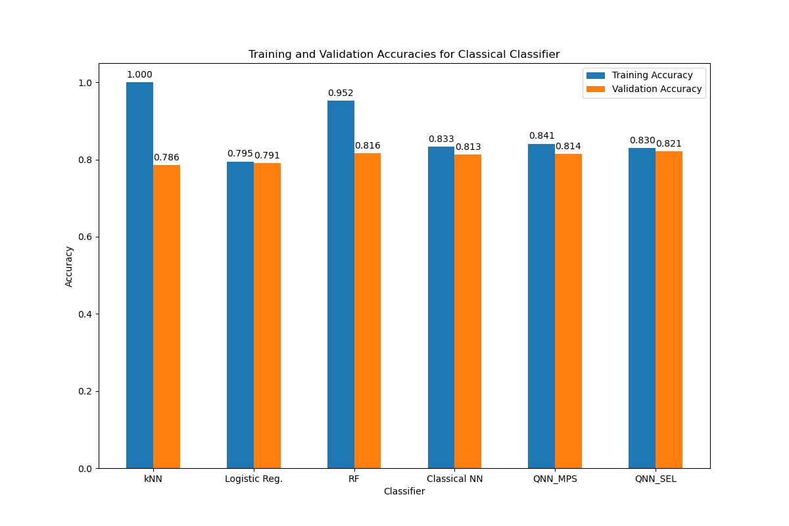
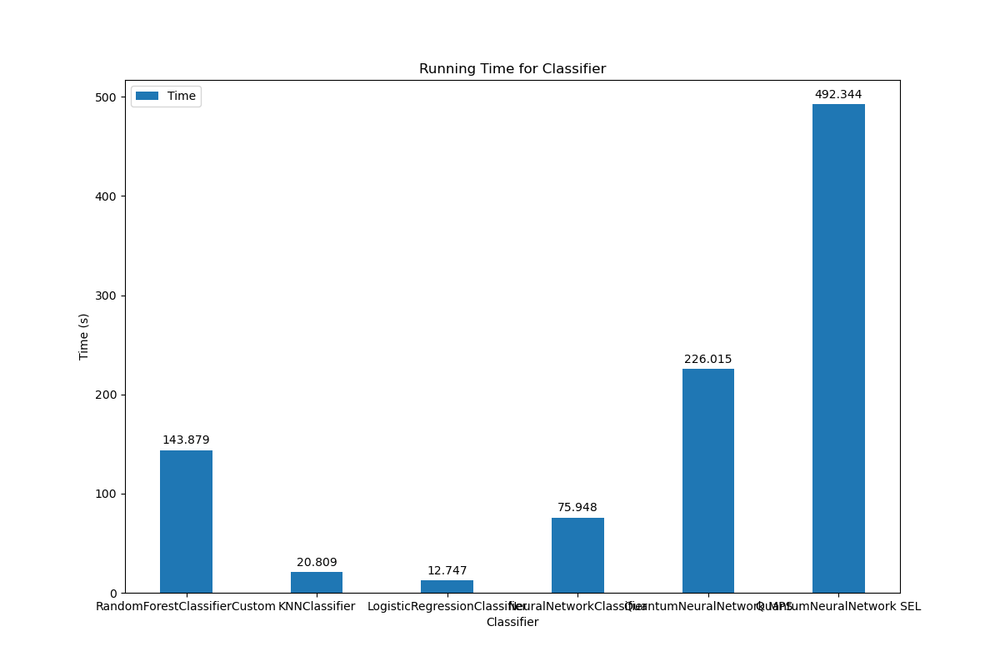

# Spaceship---titanic
This is the Kaggle competition: spaceship - titanic. We provide various machine learning solutions - both classical and quantum - to this problem.

## Packages

```bash
bash setup_env.sh
source ./.virtualenvs/jupteach/bin/activate
```


## Models
We train multiple models:
- Random Forest
- kNN
- Logistic Regression
- Classical Neural Networks
- Quantum Neural Network with Matrix Product State (MPS) Tensor Network
- Quantum Neural Network with Strongly Entangling Layers


## Results
Model parameters are stored in ./save/







## Procedure
Can run each model individually by running the model file:
```bash
python ./source/quantum_models/QuantumNN.py
```
This will run the default model (Strongly Entangling Layers circuit). To run the (Matrix Product State circuit), you need to set MPS = True in __name__ == '__main__'

# TODO
- Add a main.py file that runs all the models and print it in the files ./result/accuracy_data.txt et ./result/time_data.txt
- Add argument parsers (--MPS --SEL) and also more relevant arguments like the number of input features (m), the number of qubits per circuit (n_qubits) and the number of layers in each circuit (n_layers)
- Add a Quantum Kernel Methods
